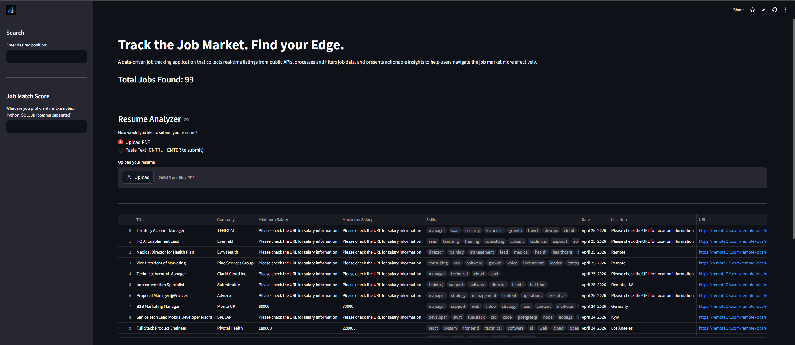
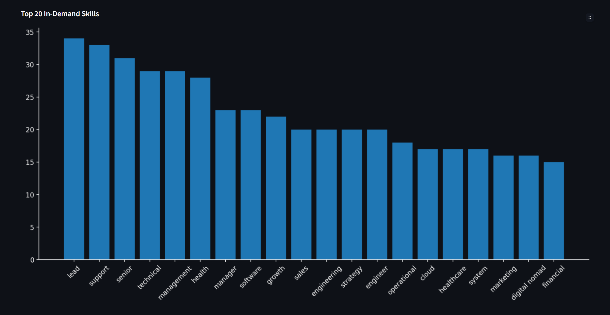
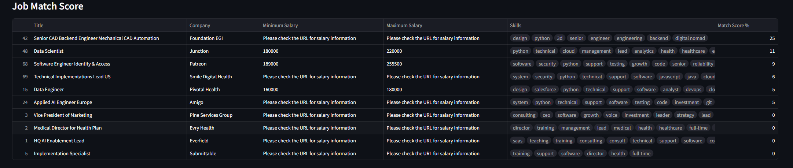
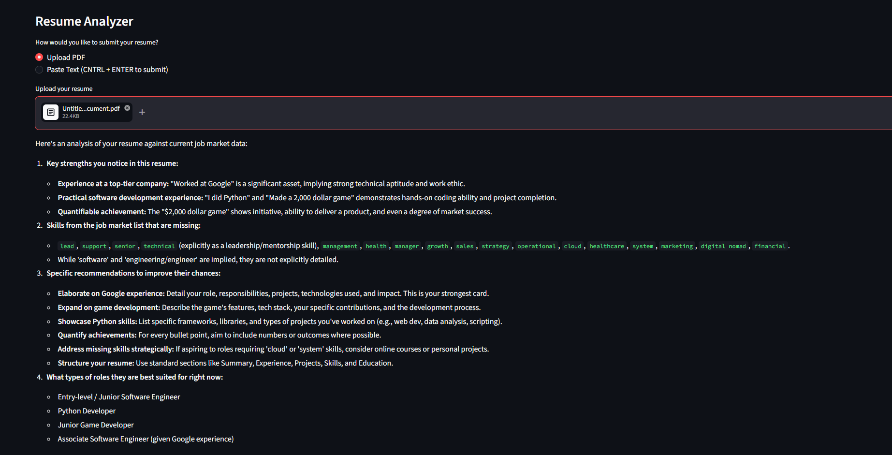

#  Job Market Tracker
A live web app that scrapes the job market in real time, analyzes which skills 
are most in demand, and lets users match their profile against current openings 
using AI-powered resume analysis.

## 🌐 Live Demo
[Click here to try it](https://job-market-tracker.streamlit.app/)

---

## 📸 Screenshots

### Home — Live Job Listings


### 📊 Top 20 In-Demand Skills


### 🎯 Job Match Score


### 📄 AI Resume Analyzer


---

## Why I Built This
I wanted to explore data science and learn how to scrape the web while building 
something genuinely useful — not just another tutorial project. The job market 
affects everyone, so I wanted to create a tool that any person could open in 
their browser and immediately get value from, no technical knowledge required.

Along the way I learned more than I expected — how to contact APIs, build data 
pipelines, design a UI, and integrate AI into a real product. This project turned 
a curiosity about data into a deployed, live application.

---

##  Tech Stack
- Python — core language
- Requests — fetching live job data from RemoteOK API
- Pandas — data cleaning and CSV export
- Matplotlib — skills demand visualization
- Streamlit — interactive web app
- Gemini AI — AI-powered resume analysis

---

## How to Run Locally
1. Clone the repo
```bash
   git clone https://github.com/ayanshv/Job-Market-Tracker.git
```
2. Install dependencies
```bash
   pip install -r requirements.txt
```
3. Add your Gemini API key to a `.env` file
GEMINI_API_KEY=your_key_here
4. Run the app
```bash
   streamlit run app.py
```

---

##  Project Structure
- `scraper.py` — fetches and cleans job data from RemoteOK API
- `analysis.py` — counts skill frequency and generates bar chart
- `resume.py` — AI resume analyzer powered by Gemini
- `app.py` — Streamlit web app
- `main.py` — runs full pipeline without UI
- `config.py` — centralized settings

